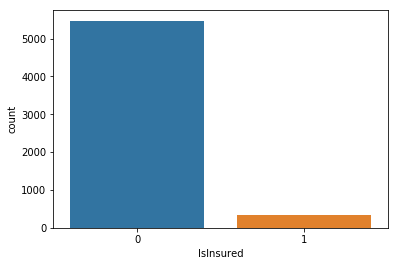
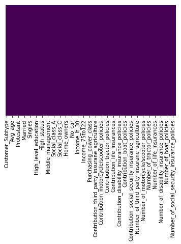
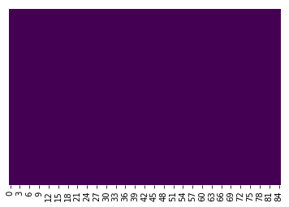
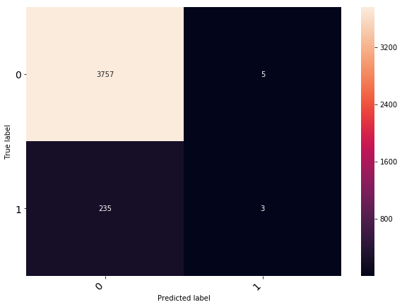
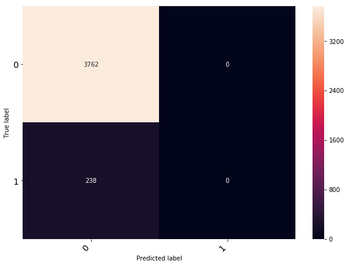
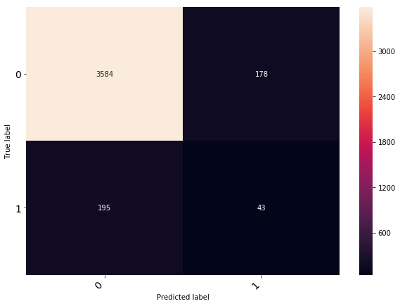

# Insurence eligibility check based on 85 features


```python
import numpy as np
import pandas as pd
from matplotlib import pyplot as plt
import seaborn as sns
from sklearn.linear_model import LogisticRegression
from sklearn.linear_model import Perceptron
from sklearn.linear_model import SGDClassifier
from sklearn.svm import SVC
from sklearn.metrics import classification_report
from sklearn.metrics import confusion_matrix
%matplotlib inline
# to display ass rows
pd.options.display.max_rows = 999
pd.options.display.max_columns = 999
```

# Loading Data


```python
baseDirectory = 'input/caravan insurance/'
trainFile = baseDirectory + 'ticdata2000.txt'
testFile = baseDirectory + 'ticeval2000.txt'
evaluationFile = baseDirectory + 'tictgts2000.txt'

headers = ['Customer_Subtype','Number_of_houses','Avg_size_household','Avg_age','Customer_main_type','Roman_catholic','Protestant','Other_religion','No_religion','Married','Living_together','Other_relation','Singles','Household_without_children','Household_with_children','High_level_education','Medium_level_education','Lower_level_education','High_status','Entrepreneur','Farmer','Middle_management','Skilled_labourers','Unskilled_labourers','Social_class_A','Social_class_B1','Social_class_B2','Social_class_C','Social_class_D','Rented_house','Home_owners','One_car','Two_cars','No_car','National_Health_Service','Private_health_insurance','Income_lt_30','Income_30to45','Income_45to75','Income_75to122','Income_gt123','Average_income','Purchasing_power_class','Contribution_private_third_party_insurance','Contribution_third_party_insurance_firms','Contribution_third_party_insurane_agriculture','Contribution_car_policies','Contribution_delivery_van_policies','Contribution_motorcycle/scooter_policies','Contribution_lorry_policies','Contribution_trailer_policies','Contribution_tractor_policies','Contribution_agricultural_machines_policies_','Contribution_moped_policies','Contribution_life_insurances','Contribution_private_accident_insurance_policies','Contribution_family_accidents_insurance_policies','Contribution_disability_insurance_policies','Contribution_fire_policies','Contribution_surfboard_policies','Contribution_boat_policies','Contribution_bicycle_policies','Contribution_property_insurance_policies','Contribution_social_security_insurance_policies','Number_of_private_third_party_insurance_1_to_12','Number_of_third_party_insurance_firms','Number_of_third_party_insurane_agriculture','Number_of_car_policies','Number_of_delivery_van_policies','Number_of_motorcycle/scooter_policies','Number_of_lorry_policies','Number_of_trailer_policies','Number_of_tractor_policies','Number_of_agricultural_machines_policies','Number_of_moped_policies','Number_of_life_insurances','Number_of_private_accident_insurance_policies','Number_of_family_accidents_insurance_policies','Number_of_disability_insurance_policies','Number_of_fire_policies','Number_of_surfboard_policies','Number_of_boat_policies','Number_of_bicycle_policies','Number_of_property_insurance_policies','Number_of_social_security_insurance_policies','IsInsured']
evaluationCol = 'IsInsured'
trainData = pd.read_csv(filepath_or_buffer=trainFile,sep='\t',header=None, names=headers)
trainHeaders = headers.copy()
trainHeaders.remove(evaluationCol)
testData = pd.read_csv(filepath_or_buffer=testFile,sep='\t',header=None, names=trainHeaders)
evaluationData = pd.read_csv(filepath_or_buffer=evaluationFile,sep='\t',header=None, names=[evaluationCol])
```

# Data Exploring


```python
print('## Train data head')
print(trainData.head())
print('## Test data head')
print(testData.head())
print('## Test result head')
print(evaluationData.head())
```

    ## Train data head
       Customer_Subtype  Number_of_houses  Avg_size_household  Avg_age  \
    0                33                 1                   3        2   
    1                37                 1                   2        2   
    2                37                 1                   2        2   
    3                 9                 1                   3        3   
    4                40                 1                   4        2   
    
       Customer_main_type  Roman_catholic  Protestant  Other_religion  \
    0                   8               0           5               1   
    1                   8               1           4               1   
    2                   8               0           4               2   
    3                   3               2           3               2   
    4                  10               1           4               1   
    
       No_religion  Married  Living_together  Other_relation  Singles  \
    0            3        7                0               2        1   
    1            4        6                2               2        0   
    2            4        3                2               4        4   
    3            4        5                2               2        2   
    4            4        7                1               2        2   
    
       Household_without_children  Household_with_children  High_level_education  \
    0                           2                        6                     1   
    1                           4                        5                     0   
    2                           4                        2                     0   
    3                           3                        4                     3   
    4                           4                        4                     5   
    
       Medium_level_education  Lower_level_education  High_status  Entrepreneur  \
    0                       2                      7            1             0   
    1                       5                      4            0             0   
    2                       5                      4            0             0   
    3                       4                      2            4             0   
    4                       4                      0            0             5   
    
       Farmer  Middle_management  Skilled_labourers  Unskilled_labourers  \
    0       1                  2                  5                    2   
    1       0                  5                  0                    4   
    2       0                  7                  0                    2   
    3       0                  3                  1                    2   
    4       4                  0                  0                    0   
    
       Social_class_A  Social_class_B1  Social_class_B2  Social_class_C  \
    0               1                1                2               6   
    1               0                2                3               5   
    2               0                5                0               4   
    3               3                2                1               4   
    4               9                0                0               0   
    
       Social_class_D  Rented_house  Home_owners  One_car  Two_cars  No_car  \
    0               1             1            8        8         0       1   
    1               0             2            7        7         1       2   
    2               0             7            2        7         0       2   
    3               0             5            4        9         0       0   
    4               0             4            5        6         2       1   
    
       National_Health_Service  Private_health_insurance  Income_lt_30  \
    0                        8                         1             0   
    1                        6                         3             2   
    2                        9                         0             4   
    3                        7                         2             1   
    4                        5                         4             0   
    
       Income_30to45  Income_45to75  Income_75to122  Income_gt123  Average_income  \
    0              4              5               0             0               4   
    1              0              5               2             0               5   
    2              5              0               0             0               3   
    3              5              3               0             0               4   
    4              0              9               0             0               6   
    
       Purchasing_power_class  Contribution_private_third_party_insurance  \
    0                       3                                           0   
    1                       4                                           2   
    2                       4                                           2   
    3                       4                                           0   
    4                       3                                           0   
    
       Contribution_third_party_insurance_firms  \
    0                                         0   
    1                                         0   
    2                                         0   
    3                                         0   
    4                                         0   
    
       Contribution_third_party_insurane_agriculture  Contribution_car_policies  \
    0                                              0                          6   
    1                                              0                          0   
    2                                              0                          6   
    3                                              0                          6   
    4                                              0                          0   
    
       Contribution_delivery_van_policies  \
    0                                   0   
    1                                   0   
    2                                   0   
    3                                   0   
    4                                   0   
    
       Contribution_motorcycle/scooter_policies  Contribution_lorry_policies  \
    0                                         0                            0   
    1                                         0                            0   
    2                                         0                            0   
    3                                         0                            0   
    4                                         0                            0   
    
       Contribution_trailer_policies  Contribution_tractor_policies  \
    0                              0                              0   
    1                              0                              0   
    2                              0                              0   
    3                              0                              0   
    4                              0                              0   
    
       Contribution_agricultural_machines_policies_  Contribution_moped_policies  \
    0                                             0                            0   
    1                                             0                            0   
    2                                             0                            0   
    3                                             0                            0   
    4                                             0                            0   
    
       Contribution_life_insurances  \
    0                             0   
    1                             0   
    2                             0   
    3                             0   
    4                             0   
    
       Contribution_private_accident_insurance_policies  \
    0                                                 0   
    1                                                 0   
    2                                                 0   
    3                                                 0   
    4                                                 0   
    
       Contribution_family_accidents_insurance_policies  \
    0                                                 0   
    1                                                 0   
    2                                                 0   
    3                                                 0   
    4                                                 0   
    
       Contribution_disability_insurance_policies  Contribution_fire_policies  \
    0                                           0                           5   
    1                                           0                           2   
    2                                           0                           2   
    3                                           0                           2   
    4                                           0                           6   
    
       Contribution_surfboard_policies  Contribution_boat_policies  \
    0                                0                           0   
    1                                0                           0   
    2                                0                           0   
    3                                0                           0   
    4                                0                           0   
    
       Contribution_bicycle_policies  Contribution_property_insurance_policies  \
    0                              0                                         0   
    1                              0                                         0   
    2                              0                                         0   
    3                              0                                         0   
    4                              0                                         0   
    
       Contribution_social_security_insurance_policies  \
    0                                                0   
    1                                                0   
    2                                                0   
    3                                                0   
    4                                                0   
    
       Number_of_private_third_party_insurance_1_to_12  \
    0                                                0   
    1                                                2   
    2                                                1   
    3                                                0   
    4                                                0   
    
       Number_of_third_party_insurance_firms  \
    0                                      0   
    1                                      0   
    2                                      0   
    3                                      0   
    4                                      0   
    
       Number_of_third_party_insurane_agriculture  Number_of_car_policies  \
    0                                           0                       1   
    1                                           0                       0   
    2                                           0                       1   
    3                                           0                       1   
    4                                           0                       0   
    
       Number_of_delivery_van_policies  Number_of_motorcycle/scooter_policies  \
    0                                0                                      0   
    1                                0                                      0   
    2                                0                                      0   
    3                                0                                      0   
    4                                0                                      0   
    
       Number_of_lorry_policies  Number_of_trailer_policies  \
    0                         0                           0   
    1                         0                           0   
    2                         0                           0   
    3                         0                           0   
    4                         0                           0   
    
       Number_of_tractor_policies  Number_of_agricultural_machines_policies  \
    0                           0                                         0   
    1                           0                                         0   
    2                           0                                         0   
    3                           0                                         0   
    4                           0                                         0   
    
       Number_of_moped_policies  Number_of_life_insurances  \
    0                         0                          0   
    1                         0                          0   
    2                         0                          0   
    3                         0                          0   
    4                         0                          0   
    
       Number_of_private_accident_insurance_policies  \
    0                                              0   
    1                                              0   
    2                                              0   
    3                                              0   
    4                                              0   
    
       Number_of_family_accidents_insurance_policies  \
    0                                              0   
    1                                              0   
    2                                              0   
    3                                              0   
    4                                              0   
    
       Number_of_disability_insurance_policies  Number_of_fire_policies  \
    0                                        0                        1   
    1                                        0                        1   
    2                                        0                        1   
    3                                        0                        1   
    4                                        0                        1   
    
       Number_of_surfboard_policies  Number_of_boat_policies  \
    0                             0                        0   
    1                             0                        0   
    2                             0                        0   
    3                             0                        0   
    4                             0                        0   
    
       Number_of_bicycle_policies  Number_of_property_insurance_policies  \
    0                           0                                      0   
    1                           0                                      0   
    2                           0                                      0   
    3                           0                                      0   
    4                           0                                      0   
    
       Number_of_social_security_insurance_policies  IsInsured  
    0                                             0          0  
    1                                             0          0  
    2                                             0          0  
    3                                             0          0  
    4                                             0          0  
    ## Test data head
       Customer_Subtype  Number_of_houses  Avg_size_household  Avg_age  \
    0                33                 1                   4        2   
    1                 6                 1                   3        2   
    2                39                 1                   3        3   
    3                 9                 1                   2        3   
    4                31                 1                   2        4   
    
       Customer_main_type  Roman_catholic  Protestant  Other_religion  \
    0                   8               0           6               0   
    1                   2               0           5               0   
    2                   9               1           4               2   
    3                   3               2           3               2   
    4                   7               0           2               0   
    
       No_religion  Married  Living_together  Other_relation  Singles  \
    0            3        5                0               4        1   
    1            4        5                2               2        1   
    2            3        5                2               3        2   
    3            4        5                4               1        2   
    4            7        9                0               0        0   
    
       Household_without_children  Household_with_children  High_level_education  \
    0                           1                        8                     2   
    1                           4                        5                     5   
    2                           3                        6                     2   
    3                           4                        4                     2   
    4                           6                        3                     0   
    
       Medium_level_education  Lower_level_education  High_status  Entrepreneur  \
    0                       2                      6            0             0   
    1                       4                      0            5             0   
    2                       4                      4            2             1   
    3                       4                      4            2             1   
    4                       0                      9            0             0   
    
       Farmer  Middle_management  Skilled_labourers  Unskilled_labourers  \
    0       1                  2                  6                    1   
    1       0                  4                  0                    0   
    2       1                  3                  2                    2   
    3       1                  5                  1                    2   
    4       0                  2                  4                    4   
    
       Social_class_A  Social_class_B1  Social_class_B2  Social_class_C  \
    0               0                2                1               5   
    1               4                3                0               2   
    2               1                1                5               2   
    3               3                1                3               2   
    4               0                0                0               7   
    
       Social_class_D  Rented_house  Home_owners  One_car  Two_cars  No_car  \
    0               3             1            8        8         1       1   
    1               1             3            6        9         0       0   
    2               1             1            8        6         2       2   
    3               2             3            6        7         2       1   
    4               2             9            0        7         2       0   
    
       National_Health_Service  Private_health_insurance  Income_lt_30  \
    0                        8                         1             3   
    1                        7                         2             1   
    2                        6                         3             2   
    3                        7                         2             2   
    4                        9                         0             5   
    
       Income_30to45  Income_45to75  Income_75to122  Income_gt123  Average_income  \
    0              3              3               0             0               3   
    1              1              5               4             0               6   
    2              4              3               1             0               3   
    3              5              3               1             0               4   
    4              4              0               0             0               3   
    
       Purchasing_power_class  Contribution_private_third_party_insurance  \
    0                       3                                           1   
    1                       8                                           2   
    2                       5                                           2   
    3                       4                                           2   
    4                       1                                           2   
    
       Contribution_third_party_insurance_firms  \
    0                                         0   
    1                                         0   
    2                                         0   
    3                                         0   
    4                                         0   
    
       Contribution_third_party_insurane_agriculture  Contribution_car_policies  \
    0                                              0                          0   
    1                                              0                          6   
    2                                              0                          6   
    3                                              0                          5   
    4                                              0                          0   
    
       Contribution_delivery_van_policies  \
    0                                   0   
    1                                   0   
    2                                   0   
    3                                   0   
    4                                   0   
    
       Contribution_motorcycle/scooter_policies  Contribution_lorry_policies  \
    0                                         0                            0   
    1                                         4                            0   
    2                                         0                            0   
    3                                         0                            0   
    4                                         0                            0   
    
       Contribution_trailer_policies  Contribution_tractor_policies  \
    0                              0                              0   
    1                              0                              0   
    2                              0                              0   
    3                              0                              0   
    4                              0                              0   
    
       Contribution_agricultural_machines_policies_  Contribution_moped_policies  \
    0                                             0                            0   
    1                                             0                            0   
    2                                             0                            0   
    3                                             0                            0   
    4                                             0                            0   
    
       Contribution_life_insurances  \
    0                             0   
    1                             3   
    2                             4   
    3                             0   
    4                             0   
    
       Contribution_private_accident_insurance_policies  \
    0                                                 0   
    1                                                 0   
    2                                                 0   
    3                                                 0   
    4                                                 0   
    
       Contribution_family_accidents_insurance_policies  \
    0                                                 0   
    1                                                 0   
    2                                                 0   
    3                                                 0   
    4                                                 0   
    
       Contribution_disability_insurance_policies  Contribution_fire_policies  \
    0                                           0                           4   
    1                                           0                           4   
    2                                           0                           4   
    3                                           0                           3   
    4                                           0                           1   
    
       Contribution_surfboard_policies  Contribution_boat_policies  \
    0                                0                           0   
    1                                0                           0   
    2                                0                           0   
    3                                0                           0   
    4                                0                           0   
    
       Contribution_bicycle_policies  Contribution_property_insurance_policies  \
    0                              0                                         0   
    1                              0                                         0   
    2                              0                                         0   
    3                              0                                         0   
    4                              0                                         0   
    
       Contribution_social_security_insurance_policies  \
    0                                                0   
    1                                                0   
    2                                                0   
    3                                                0   
    4                                                0   
    
       Number_of_private_third_party_insurance_1_to_12  \
    0                                                1   
    1                                                1   
    2                                                1   
    3                                                1   
    4                                                1   
    
       Number_of_third_party_insurance_firms  \
    0                                      0   
    1                                      0   
    2                                      0   
    3                                      0   
    4                                      0   
    
       Number_of_third_party_insurane_agriculture  Number_of_car_policies  \
    0                                           0                       0   
    1                                           0                       1   
    2                                           0                       1   
    3                                           0                       1   
    4                                           0                       0   
    
       Number_of_delivery_van_policies  Number_of_motorcycle/scooter_policies  \
    0                                0                                      0   
    1                                0                                      1   
    2                                0                                      0   
    3                                0                                      0   
    4                                0                                      0   
    
       Number_of_lorry_policies  Number_of_trailer_policies  \
    0                         0                           0   
    1                         0                           0   
    2                         0                           0   
    3                         0                           0   
    4                         0                           0   
    
       Number_of_tractor_policies  Number_of_agricultural_machines_policies  \
    0                           0                                         0   
    1                           0                                         0   
    2                           0                                         0   
    3                           0                                         0   
    4                           0                                         0   
    
       Number_of_moped_policies  Number_of_life_insurances  \
    0                         0                          0   
    1                         0                          2   
    2                         0                          1   
    3                         0                          0   
    4                         0                          0   
    
       Number_of_private_accident_insurance_policies  \
    0                                              0   
    1                                              0   
    2                                              0   
    3                                              0   
    4                                              0   
    
       Number_of_family_accidents_insurance_policies  \
    0                                              0   
    1                                              0   
    2                                              0   
    3                                              0   
    4                                              0   
    
       Number_of_disability_insurance_policies  Number_of_fire_policies  \
    0                                        0                        1   
    1                                        0                        1   
    2                                        0                        1   
    3                                        0                        1   
    4                                        0                        1   
    
       Number_of_surfboard_policies  Number_of_boat_policies  \
    0                             0                        0   
    1                             0                        0   
    2                             0                        0   
    3                             0                        0   
    4                             0                        0   
    
       Number_of_bicycle_policies  Number_of_property_insurance_policies  \
    0                           0                                      0   
    1                           0                                      0   
    2                           0                                      0   
    3                           0                                      0   
    4                           0                                      0   
    
       Number_of_social_security_insurance_policies  
    0                                             0  
    1                                             0  
    2                                             0  
    3                                             0  
    4                                             0  
    ## Test result head
       0
    0  0
    1  1
    2  0
    3  0
    4  0
    


```python
sns.countplot(trainData[evaluationCol])
```


    <matplotlib.axes._subplots.AxesSubplot at 0x27737a530f0>





```python
count0 = len([data for data in trainData[evaluationCol] if data == 0])
count1 = len([data for data in trainData[evaluationCol] if data == 1])
totalCount = len(trainData[evaluationCol])
percentCount0 = round((count0/totalCount)*100,2)
percentCount1 = round((count1/totalCount)*100,2)


print('count - 0:{} times and 1:{} times'.format(count0, count1))
print('percentage - 0:{} % and 1:{} %'.format(percentCount0, percentCount1))
```

    count - 0:5474 times and 1:348 times
    percentage - 0:94.02 % and 1:5.98 %
    

## Train Data


```python
print(trainData.info())
print(trainData.describe())
```

    <class 'pandas.core.frame.DataFrame'>
    RangeIndex: 5822 entries, 0 to 5821
    Data columns (total 86 columns):
    Customer_Subtype                                    5822 non-null int64
    Number_of_houses                                    5822 non-null int64
    Avg_size_household                                  5822 non-null int64
    Avg_age                                             5822 non-null int64
    Customer_main_type                                  5822 non-null int64
    Roman_catholic                                      5822 non-null int64
    Protestant                                          5822 non-null int64
    Other_religion                                      5822 non-null int64
    No_religion                                         5822 non-null int64
    Married                                             5822 non-null int64
    Living_together                                     5822 non-null int64
    Other_relation                                      5822 non-null int64
    Singles                                             5822 non-null int64
    Household_without_children                          5822 non-null int64
    Household_with_children                             5822 non-null int64
    High_level_education                                5822 non-null int64
    Medium_level_education                              5822 non-null int64
    Lower_level_education                               5822 non-null int64
    High_status                                         5822 non-null int64
    Entrepreneur                                        5822 non-null int64
    Farmer                                              5822 non-null int64
    Middle_management                                   5822 non-null int64
    Skilled_labourers                                   5822 non-null int64
    Unskilled_labourers                                 5822 non-null int64
    Social_class_A                                      5822 non-null int64
    Social_class_B1                                     5822 non-null int64
    Social_class_B2                                     5822 non-null int64
    Social_class_C                                      5822 non-null int64
    Social_class_D                                      5822 non-null int64
    Rented_house                                        5822 non-null int64
    Home_owners                                         5822 non-null int64
    One_car                                             5822 non-null int64
    Two_cars                                            5822 non-null int64
    No_car                                              5822 non-null int64
    National_Health_Service                             5822 non-null int64
    Private_health_insurance                            5822 non-null int64
    Income_lt_30                                        5822 non-null int64
    Income_30to45                                       5822 non-null int64
    Income_45to75                                       5822 non-null int64
    Income_75to122                                      5822 non-null int64
    Income_gt123                                        5822 non-null int64
    Average_income                                      5822 non-null int64
    Purchasing_power_class                              5822 non-null int64
    Contribution_private_third_party_insurance          5822 non-null int64
    Contribution_third_party_insurance_firms            5822 non-null int64
    Contribution_third_party_insurane_agriculture       5822 non-null int64
    Contribution_car_policies                           5822 non-null int64
    Contribution_delivery_van_policies                  5822 non-null int64
    Contribution_motorcycle/scooter_policies            5822 non-null int64
    Contribution_lorry_policies                         5822 non-null int64
    Contribution_trailer_policies                       5822 non-null int64
    Contribution_tractor_policies                       5822 non-null int64
    Contribution_agricultural_machines_policies_        5822 non-null int64
    Contribution_moped_policies                         5822 non-null int64
    Contribution_life_insurances                        5822 non-null int64
    Contribution_private_accident_insurance_policies    5822 non-null int64
    Contribution_family_accidents_insurance_policies    5822 non-null int64
    Contribution_disability_insurance_policies          5822 non-null int64
    Contribution_fire_policies                          5822 non-null int64
    Contribution_surfboard_policies                     5822 non-null int64
    Contribution_boat_policies                          5822 non-null int64
    Contribution_bicycle_policies                       5822 non-null int64
    Contribution_property_insurance_policies            5822 non-null int64
    Contribution_social_security_insurance_policies     5822 non-null int64
    Number_of_private_third_party_insurance_1_to_12     5822 non-null int64
    Number_of_third_party_insurance_firms               5822 non-null int64
    Number_of_third_party_insurane_agriculture          5822 non-null int64
    Number_of_car_policies                              5822 non-null int64
    Number_of_delivery_van_policies                     5822 non-null int64
    Number_of_motorcycle/scooter_policies               5822 non-null int64
    Number_of_lorry_policies                            5822 non-null int64
    Number_of_trailer_policies                          5822 non-null int64
    Number_of_tractor_policies                          5822 non-null int64
    Number_of_agricultural_machines_policies            5822 non-null int64
    Number_of_moped_policies                            5822 non-null int64
    Number_of_life_insurances                           5822 non-null int64
    Number_of_private_accident_insurance_policies       5822 non-null int64
    Number_of_family_accidents_insurance_policies       5822 non-null int64
    Number_of_disability_insurance_policies             5822 non-null int64
    Number_of_fire_policies                             5822 non-null int64
    Number_of_surfboard_policies                        5822 non-null int64
    Number_of_boat_policies                             5822 non-null int64
    Number_of_bicycle_policies                          5822 non-null int64
    Number_of_property_insurance_policies               5822 non-null int64
    Number_of_social_security_insurance_policies        5822 non-null int64
    IsInsured                                           5822 non-null int64
    dtypes: int64(86)
    memory usage: 3.8 MB
    None
           Customer_Subtype  Number_of_houses  Avg_size_household      Avg_age  \
    count       5822.000000       5822.000000         5822.000000  5822.000000   
    mean          24.253349          1.110615            2.678805     2.991240   
    std           12.846706          0.405842            0.789835     0.814589   
    min            1.000000          1.000000            1.000000     1.000000   
    25%           10.000000          1.000000            2.000000     2.000000   
    50%           30.000000          1.000000            3.000000     3.000000   
    75%           35.000000          1.000000            3.000000     3.000000   
    max           41.000000         10.000000            5.000000     6.000000   
    
           Customer_main_type  Roman_catholic   Protestant  Other_religion  \
    count         5822.000000     5822.000000  5822.000000     5822.000000   
    mean             5.773617        0.696496     4.626932        1.069907   
    std              2.856760        1.003234     1.715843        1.017503   
    min              1.000000        0.000000     0.000000        0.000000   
    25%              3.000000        0.000000     4.000000        0.000000   
    50%              7.000000        0.000000     5.000000        1.000000   
    75%              8.000000        1.000000     6.000000        2.000000   
    max             10.000000        9.000000     9.000000        5.000000   
    
           No_religion      Married  Living_together  Other_relation      Singles  \
    count  5822.000000  5822.000000      5822.000000     5822.000000  5822.000000   
    mean      3.258502     6.183442         0.883545        2.290450     1.887667   
    std       1.597647     1.909482         0.965924        1.722645     1.799928   
    min       0.000000     0.000000         0.000000        0.000000     0.000000   
    25%       2.000000     5.000000         0.000000        1.000000     0.000000   
    50%       3.000000     6.000000         1.000000        2.000000     2.000000   
    75%       4.000000     7.000000         1.000000        3.000000     3.000000   
    max       9.000000     9.000000         7.000000        9.000000     9.000000   
    
           Household_without_children  Household_with_children  \
    count                 5822.000000              5822.000000   
    mean                     3.230333                 4.300240   
    std                      1.619973                 2.005283   
    min                      0.000000                 0.000000   
    25%                      2.000000                 3.000000   
    50%                      3.000000                 4.000000   
    75%                      4.000000                 6.000000   
    max                      9.000000                 9.000000   
    
           High_level_education  Medium_level_education  Lower_level_education  \
    count           5822.000000             5822.000000            5822.000000   
    mean               1.461010                3.351254               4.572484   
    std                1.622967                1.761052               2.298125   
    min                0.000000                0.000000               0.000000   
    25%                0.000000                2.000000               3.000000   
    50%                1.000000                3.000000               5.000000   
    75%                2.000000                4.000000               6.000000   
    max                9.000000                9.000000               9.000000   
    
           High_status  Entrepreneur       Farmer  Middle_management  \
    count  5822.000000   5822.000000  5822.000000        5822.000000   
    mean      1.895053      0.397973     0.522329           2.899004   
    std       1.798321      0.775073     1.056926           1.839675   
    min       0.000000      0.000000     0.000000           0.000000   
    25%       0.000000      0.000000     0.000000           2.000000   
    50%       2.000000      0.000000     0.000000           3.000000   
    75%       3.000000      1.000000     1.000000           4.000000   
    max       9.000000      5.000000     9.000000           9.000000   
    
           Skilled_labourers  Unskilled_labourers  Social_class_A  \
    count        5822.000000          5822.000000     5822.000000   
    mean            2.219856             2.306424        1.620749   
    std             1.730840             1.692843        1.722882   
    min             0.000000             0.000000        0.000000   
    25%             1.000000             1.000000        0.000000   
    50%             2.000000             2.000000        1.000000   
    75%             3.000000             3.000000        2.000000   
    max             9.000000             9.000000        9.000000   
    
           Social_class_B1  Social_class_B2  Social_class_C  Social_class_D  \
    count      5822.000000      5822.000000     5822.000000     5822.000000   
    mean          1.606836         2.202508        3.758674        1.067331   
    std           1.330664         1.529319        1.935568        1.303175   
    min           0.000000         0.000000        0.000000        0.000000   
    25%           1.000000         1.000000        2.000000        0.000000   
    50%           2.000000         2.000000        4.000000        1.000000   
    75%           2.000000         3.000000        5.000000        2.000000   
    max           9.000000         9.000000        9.000000        9.000000   
    
           Rented_house  Home_owners      One_car     Two_cars       No_car  \
    count   5822.000000  5822.000000  5822.000000  5822.000000  5822.000000   
    mean       4.236860     4.771728     6.040364     1.316386     1.959464   
    std        3.089302     3.089837     1.552799     1.203072     1.599714   
    min        0.000000     0.000000     0.000000     0.000000     0.000000   
    25%        2.000000     2.000000     5.000000     0.000000     1.000000   
    50%        4.000000     5.000000     6.000000     1.000000     2.000000   
    75%        7.000000     7.000000     7.000000     2.000000     3.000000   
    max        9.000000     9.000000     9.000000     7.000000     9.000000   
    
           National_Health_Service  Private_health_insurance  Income_lt_30  \
    count              5822.000000               5822.000000   5822.000000   
    mean                  6.277053                  2.728959      2.573686   
    std                   1.978675                  1.981893      2.086099   
    min                   0.000000                  0.000000      0.000000   
    25%                   5.000000                  1.000000      1.000000   
    50%                   7.000000                  2.000000      2.000000   
    75%                   8.000000                  4.000000      4.000000   
    max                   9.000000                  9.000000      9.000000   
    
           Income_30to45  Income_45to75  Income_75to122  Income_gt123  \
    count    5822.000000    5822.000000     5822.000000   5822.000000   
    mean        3.536070       2.731364        0.796118      0.202679   
    std         1.882656       1.927738        1.162829      0.551557   
    min         0.000000       0.000000        0.000000      0.000000   
    25%         2.000000       1.000000        0.000000      0.000000   
    50%         4.000000       3.000000        0.000000      0.000000   
    75%         5.000000       4.000000        1.000000      0.000000   
    max         9.000000       9.000000        9.000000      9.000000   
    
           Average_income  Purchasing_power_class  \
    count     5822.000000             5822.000000   
    mean         3.784438                4.236345   
    std          1.317783                2.007150   
    min          0.000000                1.000000   
    25%          3.000000                3.000000   
    50%          4.000000                4.000000   
    75%          4.000000                6.000000   
    max          9.000000                8.000000   
    
           Contribution_private_third_party_insurance  \
    count                                 5822.000000   
    mean                                     0.771213   
    std                                      0.958623   
    min                                      0.000000   
    25%                                      0.000000   
    50%                                      0.000000   
    75%                                      2.000000   
    max                                      3.000000   
    
           Contribution_third_party_insurance_firms  \
    count                               5822.000000   
    mean                                   0.040021   
    std                                    0.362680   
    min                                    0.000000   
    25%                                    0.000000   
    50%                                    0.000000   
    75%                                    0.000000   
    max                                    6.000000   
    
           Contribution_third_party_insurane_agriculture  \
    count                                    5822.000000   
    mean                                        0.071625   
    std                                         0.499980   
    min                                         0.000000   
    25%                                         0.000000   
    50%                                         0.000000   
    75%                                         0.000000   
    max                                         4.000000   
    
           Contribution_car_policies  Contribution_delivery_van_policies  \
    count                5822.000000                         5822.000000   
    mean                    2.970457                            0.048265   
    std                     2.920669                            0.531346   
    min                     0.000000                            0.000000   
    25%                     0.000000                            0.000000   
    50%                     5.000000                            0.000000   
    75%                     6.000000                            0.000000   
    max                     8.000000                            7.000000   
    
           Contribution_motorcycle/scooter_policies  Contribution_lorry_policies  \
    count                               5822.000000                  5822.000000   
    mean                                   0.175369                     0.009447   
    std                                    0.897222                     0.244675   
    min                                    0.000000                     0.000000   
    25%                                    0.000000                     0.000000   
    50%                                    0.000000                     0.000000   
    75%                                    0.000000                     0.000000   
    max                                    7.000000                     9.000000   
    
           Contribution_trailer_policies  Contribution_tractor_policies  \
    count                    5822.000000                    5822.000000   
    mean                        0.020955                       0.092580   
    std                         0.212738                       0.603076   
    min                         0.000000                       0.000000   
    25%                         0.000000                       0.000000   
    50%                         0.000000                       0.000000   
    75%                         0.000000                       0.000000   
    max                         5.000000                       6.000000   
    
           Contribution_agricultural_machines_policies_  \
    count                                   5822.000000   
    mean                                       0.013054   
    std                                        0.228906   
    min                                        0.000000   
    25%                                        0.000000   
    50%                                        0.000000   
    75%                                        0.000000   
    max                                        6.000000   
    
           Contribution_moped_policies  Contribution_life_insurances  \
    count                  5822.000000                   5822.000000   
    mean                      0.215046                      0.194778   
    std                       0.813133                      0.898100   
    min                       0.000000                      0.000000   
    25%                       0.000000                      0.000000   
    50%                       0.000000                      0.000000   
    75%                       0.000000                      0.000000   
    max                       6.000000                      9.000000   
    
           Contribution_private_accident_insurance_policies  \
    count                                       5822.000000   
    mean                                           0.013741   
    std                                            0.209260   
    min                                            0.000000   
    25%                                            0.000000   
    50%                                            0.000000   
    75%                                            0.000000   
    max                                            6.000000   
    
           Contribution_family_accidents_insurance_policies  \
    count                                       5822.000000   
    mean                                           0.015287   
    std                                            0.192471   
    min                                            0.000000   
    25%                                            0.000000   
    50%                                            0.000000   
    75%                                            0.000000   
    max                                            3.000000   
    
           Contribution_disability_insurance_policies  Contribution_fire_policies  \
    count                                 5822.000000                 5822.000000   
    mean                                     0.023531                    1.827722   
    std                                      0.375274                    1.879290   
    min                                      0.000000                    0.000000   
    25%                                      0.000000                    0.000000   
    50%                                      0.000000                    2.000000   
    75%                                      0.000000                    4.000000   
    max                                      7.000000                    8.000000   
    
           Contribution_surfboard_policies  Contribution_boat_policies  \
    count                      5822.000000                 5822.000000   
    mean                          0.000859                    0.018894   
    std                           0.043462                    0.273028   
    min                           0.000000                    0.000000   
    25%                           0.000000                    0.000000   
    50%                           0.000000                    0.000000   
    75%                           0.000000                    0.000000   
    max                           3.000000                    6.000000   
    
           Contribution_bicycle_policies  \
    count                    5822.000000   
    mean                        0.025249   
    std                         0.156894   
    min                         0.000000   
    25%                         0.000000   
    50%                         0.000000   
    75%                         0.000000   
    max                         1.000000   
    
           Contribution_property_insurance_policies  \
    count                                5822.00000   
    mean                                    0.01563   
    std                                     0.20456   
    min                                     0.00000   
    25%                                     0.00000   
    50%                                     0.00000   
    75%                                     0.00000   
    max                                     6.00000   
    
           Contribution_social_security_insurance_policies  \
    count                                      5822.000000   
    mean                                          0.047578   
    std                                           0.409016   
    min                                           0.000000   
    25%                                           0.000000   
    50%                                           0.000000   
    75%                                           0.000000   
    max                                           5.000000   
    
           Number_of_private_third_party_insurance_1_to_12  \
    count                                      5822.000000   
    mean                                          0.402954   
    std                                           0.492631   
    min                                           0.000000   
    25%                                           0.000000   
    50%                                           0.000000   
    75%                                           1.000000   
    max                                           2.000000   
    
           Number_of_third_party_insurance_firms  \
    count                            5822.000000   
    mean                                0.014772   
    std                                 0.134133   
    min                                 0.000000   
    25%                                 0.000000   
    50%                                 0.000000   
    75%                                 0.000000   
    max                                 5.000000   
    
           Number_of_third_party_insurane_agriculture  Number_of_car_policies  \
    count                                 5822.000000             5822.000000   
    mean                                     0.020611                0.562178   
    std                                      0.142092                0.604767   
    min                                      0.000000                0.000000   
    25%                                      0.000000                0.000000   
    50%                                      0.000000                1.000000   
    75%                                      0.000000                1.000000   
    max                                      1.000000                7.000000   
    
           Number_of_delivery_van_policies  Number_of_motorcycle/scooter_policies  \
    count                      5822.000000                            5822.000000   
    mean                          0.010477                               0.041051   
    std                           0.129991                               0.228974   
    min                           0.000000                               0.000000   
    25%                           0.000000                               0.000000   
    50%                           0.000000                               0.000000   
    75%                           0.000000                               0.000000   
    max                           4.000000                               8.000000   
    
           Number_of_lorry_policies  Number_of_trailer_policies  \
    count               5822.000000                 5822.000000   
    mean                   0.002233                    0.012539   
    std                    0.062819                    0.125775   
    min                    0.000000                    0.000000   
    25%                    0.000000                    0.000000   
    50%                    0.000000                    0.000000   
    75%                    0.000000                    0.000000   
    max                    3.000000                    3.000000   
    
           Number_of_tractor_policies  Number_of_agricultural_machines_policies  \
    count                 5822.000000                               5822.000000   
    mean                     0.033665                                  0.006183   
    std                      0.240755                                  0.124189   
    min                      0.000000                                  0.000000   
    25%                      0.000000                                  0.000000   
    50%                      0.000000                                  0.000000   
    75%                      0.000000                                  0.000000   
    max                      4.000000                                  6.000000   
    
           Number_of_moped_policies  Number_of_life_insurances  \
    count               5822.000000                5822.000000   
    mean                   0.070423                   0.076606   
    std                    0.265112                   0.377569   
    min                    0.000000                   0.000000   
    25%                    0.000000                   0.000000   
    50%                    0.000000                   0.000000   
    75%                    0.000000                   0.000000   
    max                    2.000000                   8.000000   
    
           Number_of_private_accident_insurance_policies  \
    count                                    5822.000000   
    mean                                        0.005325   
    std                                         0.072782   
    min                                         0.000000   
    25%                                         0.000000   
    50%                                         0.000000   
    75%                                         0.000000   
    max                                         1.000000   
    
           Number_of_family_accidents_insurance_policies  \
    count                                    5822.000000   
    mean                                        0.006527   
    std                                         0.080532   
    min                                         0.000000   
    25%                                         0.000000   
    50%                                         0.000000   
    75%                                         0.000000   
    max                                         1.000000   
    
           Number_of_disability_insurance_policies  Number_of_fire_policies  \
    count                              5822.000000              5822.000000   
    mean                                  0.004638                 0.570079   
    std                                   0.077403                 0.562058   
    min                                   0.000000                 0.000000   
    25%                                   0.000000                 0.000000   
    50%                                   0.000000                 1.000000   
    75%                                   0.000000                 1.000000   
    max                                   2.000000                 7.000000   
    
           Number_of_surfboard_policies  Number_of_boat_policies  \
    count                   5822.000000              5822.000000   
    mean                       0.000515                 0.006012   
    std                        0.022696                 0.081632   
    min                        0.000000                 0.000000   
    25%                        0.000000                 0.000000   
    50%                        0.000000                 0.000000   
    75%                        0.000000                 0.000000   
    max                        1.000000                 2.000000   
    
           Number_of_bicycle_policies  Number_of_property_insurance_policies  \
    count                 5822.000000                            5822.000000   
    mean                     0.031776                               0.007901   
    std                      0.210986                               0.090463   
    min                      0.000000                               0.000000   
    25%                      0.000000                               0.000000   
    50%                      0.000000                               0.000000   
    75%                      0.000000                               0.000000   
    max                      3.000000                               2.000000   
    
           Number_of_social_security_insurance_policies    IsInsured  
    count                                   5822.000000  5822.000000  
    mean                                       0.014256     0.059773  
    std                                        0.119996     0.237087  
    min                                        0.000000     0.000000  
    25%                                        0.000000     0.000000  
    50%                                        0.000000     0.000000  
    75%                                        0.000000     0.000000  
    max                                        2.000000     1.000000  
    


```python
sns.countplot(evaluationData[evaluationCol])
```


    <matplotlib.axes._subplots.AxesSubplot at 0x27737a60c88>


```python
count0 = len([data for data in evaluationData[evaluationCol] if data == 0])
count1 = len([data for data in evaluationData[evaluationCol] if data == 1])
totalCount = len(evaluationData[evaluationCol])
percentCount0 = round((count0/totalCount)*100,2)
percentCount1 = round((count1/totalCount)*100,2)


print('count - 0:{} times and 1:{} times'.format(count0, count1))
print('percentage - 0:{} % and 1:{} %'.format(percentCount0, percentCount1))
```

    count - 0:3762 times and 1:238 times
    percentage - 0:94.05 % and 1:5.95 %
    

## Test Data


```python
print(testData.info())
print(testData.describe())
```

    <class 'pandas.core.frame.DataFrame'>
    RangeIndex: 4000 entries, 0 to 3999
    Data columns (total 85 columns):
    0     4000 non-null int64
    1     4000 non-null int64
    2     4000 non-null int64
    3     4000 non-null int64
    4     4000 non-null int64
    5     4000 non-null int64
    6     4000 non-null int64
    7     4000 non-null int64
    8     4000 non-null int64
    9     4000 non-null int64
    10    4000 non-null int64
    11    4000 non-null int64
    12    4000 non-null int64
    13    4000 non-null int64
    14    4000 non-null int64
    15    4000 non-null int64
    16    4000 non-null int64
    17    4000 non-null int64
    18    4000 non-null int64
    19    4000 non-null int64
    20    4000 non-null int64
    21    4000 non-null int64
    22    4000 non-null int64
    23    4000 non-null int64
    24    4000 non-null int64
    25    4000 non-null int64
    26    4000 non-null int64
    27    4000 non-null int64
    28    4000 non-null int64
    29    4000 non-null int64
    30    4000 non-null int64
    31    4000 non-null int64
    32    4000 non-null int64
    33    4000 non-null int64
    34    4000 non-null int64
    35    4000 non-null int64
    36    4000 non-null int64
    37    4000 non-null int64
    38    4000 non-null int64
    39    4000 non-null int64
    40    4000 non-null int64
    41    4000 non-null int64
    42    4000 non-null int64
    43    4000 non-null int64
    44    4000 non-null int64
    45    4000 non-null int64
    46    4000 non-null int64
    47    4000 non-null int64
    48    4000 non-null int64
    49    4000 non-null int64
    50    4000 non-null int64
    51    4000 non-null int64
    52    4000 non-null int64
    53    4000 non-null int64
    54    4000 non-null int64
    55    4000 non-null int64
    56    4000 non-null int64
    57    4000 non-null int64
    58    4000 non-null int64
    59    4000 non-null int64
    60    4000 non-null int64
    61    4000 non-null int64
    62    4000 non-null int64
    63    4000 non-null int64
    64    4000 non-null int64
    65    4000 non-null int64
    66    4000 non-null int64
    67    4000 non-null int64
    68    4000 non-null int64
    69    4000 non-null int64
    70    4000 non-null int64
    71    4000 non-null int64
    72    4000 non-null int64
    73    4000 non-null int64
    74    4000 non-null int64
    75    4000 non-null int64
    76    4000 non-null int64
    77    4000 non-null int64
    78    4000 non-null int64
    79    4000 non-null int64
    80    4000 non-null int64
    81    4000 non-null int64
    82    4000 non-null int64
    83    4000 non-null int64
    84    4000 non-null int64
    dtypes: int64(85)
    memory usage: 2.6 MB
    None
                    0           1            2            3            4   \
    count  4000.000000  4000.00000  4000.000000  4000.000000  4000.000000   
    mean     24.253000     1.10600     2.675750     3.004000     5.787000   
    std      13.022822     0.42108     0.767306     0.790025     2.899609   
    min       1.000000     1.00000     1.000000     1.000000     1.000000   
    25%      10.000000     1.00000     2.000000     3.000000     3.000000   
    50%      30.000000     1.00000     3.000000     3.000000     7.000000   
    75%      35.000000     1.00000     3.000000     3.000000     8.000000   
    max      41.000000    10.00000     6.000000     6.000000    10.000000   
    
                    5            6            7            8            9   \
    count  4000.000000  4000.000000  4000.000000  4000.000000  4000.000000   
    mean      0.706750     4.653250     1.021250     3.269500     6.197000   
    std       1.032241     1.729093     1.001274     1.618958     1.876585   
    min       0.000000     0.000000     0.000000     0.000000     0.000000   
    25%       0.000000     4.000000     0.000000     2.000000     5.000000   
    50%       0.000000     5.000000     1.000000     3.000000     6.000000   
    75%       1.000000     6.000000     2.000000     4.000000     7.000000   
    max       9.000000     9.000000     5.000000     9.000000     9.000000   
    
                    10           11           12           13          14  \
    count  4000.000000  4000.000000  4000.000000  4000.000000  4000.00000   
    mean      0.858000     2.281000     1.886750     3.247500     4.30675   
    std       0.956067     1.693297     1.748911     1.593386     1.95323   
    min       0.000000     0.000000     0.000000     0.000000     0.00000   
    25%       0.000000     1.000000     0.000000     2.000000     3.00000   
    50%       1.000000     2.000000     2.000000     3.000000     4.00000   
    75%       1.000000     3.000000     3.000000     4.000000     6.00000   
    max       7.000000     9.000000     9.000000     9.000000     9.00000   
    
                    15           16           17           18          19  \
    count  4000.000000  4000.000000  4000.000000  4000.000000  4000.00000   
    mean      1.518750     3.243250     4.620500     1.904250     0.41100   
    std       1.678497     1.665164     2.252942     1.837778     0.80358   
    min       0.000000     0.000000     0.000000     0.000000     0.00000   
    25%       0.000000     2.000000     3.000000     0.000000     0.00000   
    50%       1.000000     3.000000     5.000000     2.000000     0.00000   
    75%       2.000000     4.000000     6.000000     3.000000     1.00000   
    max       9.000000     9.000000     9.000000     9.000000     5.00000   
    
                    20           21           22           23          24  \
    count  4000.000000  4000.000000  4000.000000  4000.000000  4000.00000   
    mean      0.579750     2.845250     2.236250     2.269000     1.69425   
    std       1.173876     1.856654     1.772913     1.671029     1.76976   
    min       0.000000     0.000000     0.000000     0.000000     0.00000   
    25%       0.000000     2.000000     1.000000     1.000000     0.00000   
    50%       0.000000     3.000000     2.000000     2.000000     1.00000   
    75%       1.000000     4.000000     3.000000     3.000000     2.00000   
    max       9.000000     9.000000     9.000000     9.000000     9.00000   
    
                    25           26           27           28           29  \
    count  4000.000000  4000.000000  4000.000000  4000.000000  4000.000000   
    mean      1.578000     2.208000     3.718250     1.069500     4.116250   
    std       1.307992     1.541373     1.958399     1.291157     3.097682   
    min       0.000000     0.000000     0.000000     0.000000     0.000000   
    25%       1.000000     1.000000     2.000000     0.000000     1.000000   
    50%       2.000000     2.000000     4.000000     1.000000     4.000000   
    75%       2.000000     3.000000     5.000000     2.000000     7.000000   
    max       9.000000     9.000000     9.000000     8.000000     9.000000   
    
                    30           31           32           33           34  \
    count  4000.000000  4000.000000  4000.000000  4000.000000  4000.000000   
    mean      4.889000     5.996500     1.364500     1.952750     6.221250   
    std       3.097996     1.530873     1.228421     1.592844     2.031337   
    min       0.000000     0.000000     0.000000     0.000000     0.000000   
    25%       2.000000     5.000000     0.000000     0.000000     5.000000   
    50%       5.000000     6.000000     1.000000     2.000000     7.000000   
    75%       8.000000     7.000000     2.000000     3.000000     8.000000   
    max       9.000000     9.000000     9.000000     9.000000     9.000000   
    
                    35           36           37           38           39  \
    count  4000.000000  4000.000000  4000.000000  4000.000000  4000.000000   
    mean      2.782250     2.582000     3.461000     2.751250     0.826500   
    std       2.033069     2.054344     1.854141     1.983647     1.189433   
    min       0.000000     0.000000     0.000000     0.000000     0.000000   
    25%       1.000000     1.000000     2.000000     1.000000     0.000000   
    50%       2.000000     2.000000     3.000000     3.000000     0.000000   
    75%       4.000000     4.000000     5.000000     4.000000     1.000000   
    max       9.000000     9.000000     9.000000     9.000000     9.000000   
    
                    40           41           42           43           44  \
    count  4000.000000  4000.000000  4000.000000  4000.000000  4000.000000   
    mean      0.215750     3.833750     4.295250     0.755750     0.037250   
    std       0.576442     1.349469     1.986596     0.953582     0.348415   
    min       0.000000     0.000000     1.000000     0.000000     0.000000   
    25%       0.000000     3.000000     3.000000     0.000000     0.000000   
    50%       0.000000     4.000000     4.000000     0.000000     0.000000   
    75%       0.000000     4.000000     6.000000     2.000000     0.000000   
    max       6.000000     9.000000     8.000000     3.000000     6.000000   
    
                    45           46           47           48           49  \
    count  4000.000000  4000.000000  4000.000000  4000.000000  4000.000000   
    mean      0.076750     2.936000     0.064500     0.164250     0.008000   
    std       0.519063     2.923532     0.613134     0.875765     0.226823   
    min       0.000000     0.000000     0.000000     0.000000     0.000000   
    25%       0.000000     0.000000     0.000000     0.000000     0.000000   
    50%       0.000000     5.000000     0.000000     0.000000     0.000000   
    75%       0.000000     6.000000     0.000000     0.000000     0.000000   
    max       4.000000     9.000000     7.000000     6.000000     7.000000   
    
                    50           51           52           53           54  \
    count  4000.000000  4000.000000  4000.000000  4000.000000  4000.000000   
    mean      0.017000     0.095000     0.009250     0.215000     0.213250   
    std       0.182262     0.606273     0.194098     0.807736     0.928434   
    min       0.000000     0.000000     0.000000     0.000000     0.000000   
    25%       0.000000     0.000000     0.000000     0.000000     0.000000   
    50%       0.000000     0.000000     0.000000     0.000000     0.000000   
    75%       0.000000     0.000000     0.000000     0.000000     0.000000   
    max       3.000000     7.000000     6.000000     6.000000     7.000000   
    
                    55           56           57           58           59  \
    count  4000.000000  4000.000000  4000.000000  4000.000000  4000.000000   
    mean      0.008250     0.023750     0.023000     1.881000     0.002750   
    std       0.153909     0.241248     0.375508     1.883939     0.072414   
    min       0.000000     0.000000     0.000000     0.000000     0.000000   
    25%       0.000000     0.000000     0.000000     0.000000     0.000000   
    50%       0.000000     0.000000     0.000000     2.000000     0.000000   
    75%       0.000000     0.000000     0.000000     4.000000     0.000000   
    max       5.000000     3.000000     7.000000     8.000000     2.000000   
    
                    60           61           62           63           64  \
    count  4000.000000  4000.000000  4000.000000  4000.000000  4000.000000   
    mean      0.010000     0.025500     0.018250     0.042250     0.395750   
    std       0.194704     0.157658     0.221199     0.378815     0.491113   
    min       0.000000     0.000000     0.000000     0.000000     0.000000   
    25%       0.000000     0.000000     0.000000     0.000000     0.000000   
    50%       0.000000     0.000000     0.000000     0.000000     0.000000   
    75%       0.000000     0.000000     0.000000     0.000000     1.000000   
    max       5.000000     1.000000     6.000000     5.000000     2.000000   
    
                    65           66          67           68           69  \
    count  4000.000000  4000.000000  4000.00000  4000.000000  4000.000000   
    mean      0.013000     0.022250     0.55000     0.012000     0.039000   
    std       0.113288     0.147514     0.61408     0.129847     0.215617   
    min       0.000000     0.000000     0.00000     0.000000     0.000000   
    25%       0.000000     0.000000     0.00000     0.000000     0.000000   
    50%       0.000000     0.000000     1.00000     0.000000     0.000000   
    75%       0.000000     0.000000     1.00000     0.000000     0.000000   
    max       1.000000     1.000000    12.00000     5.000000     3.000000   
    
                    70           71           72           73           74  \
    count  4000.000000  4000.000000  4000.000000  4000.000000  4000.000000   
    mean      0.002250     0.009750     0.035500     0.003750     0.072000   
    std       0.075805     0.100784     0.262215     0.085075     0.270803   
    min       0.000000     0.000000     0.000000     0.000000     0.000000   
    25%       0.000000     0.000000     0.000000     0.000000     0.000000   
    50%       0.000000     0.000000     0.000000     0.000000     0.000000   
    75%       0.000000     0.000000     0.000000     0.000000     0.000000   
    max       4.000000     2.000000     6.000000     4.000000     3.000000   
    
                    75           76           77          78           79  \
    count  4000.000000  4000.000000  4000.000000  4000.00000  4000.000000   
    mean      0.084500     0.003500     0.010000     0.00375     0.579750   
    std       0.394206     0.059065     0.099511     0.06113     0.560106   
    min       0.000000     0.000000     0.000000     0.00000     0.000000   
    25%       0.000000     0.000000     0.000000     0.00000     0.000000   
    50%       0.000000     0.000000     0.000000     0.00000     1.000000   
    75%       0.000000     0.000000     0.000000     0.00000     1.000000   
    max       5.000000     1.000000     1.000000     1.00000     6.000000   
    
                    80           81           82           83           84  
    count  4000.000000  4000.000000  4000.000000  4000.000000  4000.000000  
    mean      0.001500     0.003750     0.031000     0.009250     0.013250  
    std       0.038706     0.072369     0.206276     0.095743     0.114358  
    min       0.000000     0.000000     0.000000     0.000000     0.000000  
    25%       0.000000     0.000000     0.000000     0.000000     0.000000  
    50%       0.000000     0.000000     0.000000     0.000000     0.000000  
    75%       0.000000     0.000000     0.000000     0.000000     0.000000  
    max       1.000000     2.000000     4.000000     1.000000     1.000000  
    

## Total Entries


```python
trainLen = len(trainData)
testLen = len(testData)
total = trainLen + testLen
percentTrain = (trainLen/total)*100
percentTest = (testLen/total)*100
print('Total entry (trian({0}) + test({1})) = {2}'.format(trainLen,testLen,total))
print('Percentage train-{0}% test-{1}%'.format(round(percentTrain,2), round(percentTest,2)))
```

    Total entry (trian(5822) + test(4000)) = 9822
    Percentage train-59.28% test-40.72%
    

## Missing Value Checking

### Train data


```python
sns.heatmap(trainData.isnull(),yticklabels=False,cbar=False,cmap='viridis')
```


    <matplotlib.axes._subplots.AxesSubplot at 0x277369025c0>





Test data


```python
sns.heatmap(testData.isnull(),yticklabels=False,cbar=False,cmap='viridis')
```


    <matplotlib.axes._subplots.AxesSubplot at 0x27736a1f550>





# Train


```python
y = trainData[evaluationCol]
x = trainData.drop(columns=[evaluationCol],axis=1)
logmodel = LogisticRegression()
svmmodel = SVC()
perceptronmodel = Perceptron()
sgdmodel = SGDClassifier()

logmodel.fit(x,y)
svmmodel.fit(x,y)
perceptronmodel.fit(x,y)
sgdmodel.fit(x,y)
```

    C:\ProgramData\Anaconda3\lib\site-packages\sklearn\linear_model\stochastic_gradient.py:128: FutureWarning: max_iter and tol parameters have been added in <class 'sklearn.linear_model.stochastic_gradient.SGDClassifier'> in 0.19. If both are left unset, they default to max_iter=5 and tol=None. If tol is not None, max_iter defaults to max_iter=1000. From 0.21, default max_iter will be 1000, and default tol will be 1e-3.
      "and default tol will be 1e-3." % type(self), FutureWarning)
    C:\ProgramData\Anaconda3\lib\site-packages\sklearn\linear_model\stochastic_gradient.py:128: FutureWarning: max_iter and tol parameters have been added in <class 'sklearn.linear_model.perceptron.Perceptron'> in 0.19. If both are left unset, they default to max_iter=5 and tol=None. If tol is not None, max_iter defaults to max_iter=1000. From 0.21, default max_iter will be 1000, and default tol will be 1e-3.
      "and default tol will be 1e-3." % type(self), FutureWarning)
    


    Perceptron(alpha=0.0001, class_weight=None, eta0=1.0, fit_intercept=True,
          max_iter=None, n_iter=None, n_jobs=1, penalty=None, random_state=0,
          shuffle=True, tol=None, verbose=0, warm_start=False)


# Evaluation


```python
def print_confusion_matrix(confusion_matrix, class_names, figsize = (10,7), fontsize=14):
    """Prints a confusion matrix, as returned by sklearn.metrics.confusion_matrix, as a heatmap.
    
    Arguments
    ---------
    confusion_matrix: numpy.ndarray
        The numpy.ndarray object returned from a call to sklearn.metrics.confusion_matrix. 
        Similarly constructed ndarrays can also be used.
    class_names: list
        An ordered list of class names, in the order they index the given confusion matrix.
    figsize: tuple
        A 2-long tuple, the first value determining the horizontal size of the ouputted figure,
        the second determining the vertical size. Defaults to (10,7).
    fontsize: int
        Font size for axes labels. Defaults to 14.
        
    Returns
    -------
    matplotlib.figure.Figure
        The resulting confusion matrix figure
    """
    df_cm = pd.DataFrame(
        confusion_matrix, index=class_names, columns=class_names, 
    )
    fig = plt.figure(figsize=figsize)
    try:
        heatmap = sns.heatmap(df_cm, annot=True, fmt="d")
    except ValueError:
        raise ValueError("Confusion matrix values must be integers.")
    heatmap.yaxis.set_ticklabels(heatmap.yaxis.get_ticklabels(), rotation=0, ha='right', fontsize=fontsize)
    heatmap.xaxis.set_ticklabels(heatmap.xaxis.get_ticklabels(), rotation=45, ha='right', fontsize=fontsize)
    plt.ylabel('True label')
    plt.xlabel('Predicted label')
    return fig

def evalute(predictions, model, showLogs = False):
    result = logmodel.score(testData,evaluationData)
    print('accuracy of {} - {}'.format(model, result))
    if showLogs:
        print_confusion_matrix(confusion_matrix(evaluationData, predictions),['0','1'])
        print(classification_report(evaluationData ,predictions))
```


```python
evalute(logmodel.predict(testData), model='Logistic regression',showLogs = True)
evalute(svmmodel.predict(testData), model='SVM',showLogs = True)
evalute(perceptronmodel.predict(testData), model='perceptron',showLogs = True)
evalute(sgdmodel.predict(testData), model='SGD',showLogs = True)
```

    accuracy of Logistic regression - 0.94
                 precision    recall  f1-score   support
    
              0       0.94      1.00      0.97      3762
              1       0.38      0.01      0.02       238
    
    avg / total       0.91      0.94      0.91      4000
    
    accuracy of SVM - 0.94
                 precision    recall  f1-score   support
    
              0       0.94      1.00      0.97      3762
              1       0.00      0.00      0.00       238
    
    avg / total       0.88      0.94      0.91      4000
    
    accuracy of perceptron - 0.94
                 precision    recall  f1-score   support
    
              0       0.94      1.00      0.97      3762
              1       0.00      0.00      0.00       238
    
    avg / total       0.88      0.94      0.91      4000
    
    accuracy of SGD - 0.94
    

    C:\ProgramData\Anaconda3\lib\site-packages\sklearn\metrics\classification.py:1135: UndefinedMetricWarning: Precision and F-score are ill-defined and being set to 0.0 in labels with no predicted samples.
      'precision', 'predicted', average, warn_for)
    C:\ProgramData\Anaconda3\lib\site-packages\sklearn\metrics\classification.py:1135: UndefinedMetricWarning: Precision and F-score are ill-defined and being set to 0.0 in labels with no predicted samples.
      'precision', 'predicted', average, warn_for)
    

                 precision    recall  f1-score   support
    
              0       0.95      0.95      0.95      3762
              1       0.19      0.18      0.19       238
    
    avg / total       0.90      0.91      0.91      4000
    
    











# comments
* The accuracy is not satisfactory
* The true negative and false negative rate is very high. So it is biased to negation.

# References
01. [data set](https://archive.ics.uci.edu/ml/datasets/Insurance+Company+Benchmark+%28COIL+2000%29)
02. [pretty confusion matrix](https://gist.github.com/shaypal5/94c53d765083101efc0240d776a23823)
